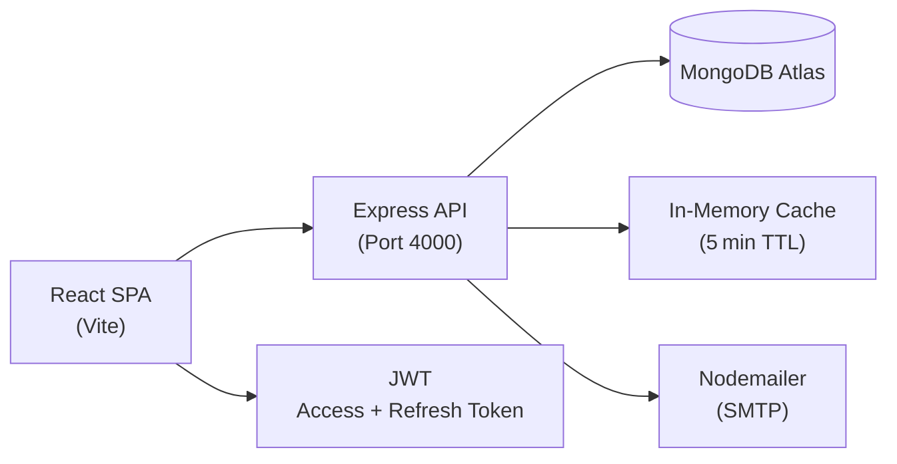

# EventHub

> A full‑stack event discovery and management platform — browse, register, and manage events with smart recommendations and an admin analytics dashboard.


## Features

- 🔍 **Discover Events** — Browse, search, and filter events by category, date, and venue
- 🎫 **Register & QR Tickets** — One‑click registration with QR codes for event check‑in
- 🤖 **Smart Recommendations** — Hybrid engine (content‑based, collaborative, popularity, and NLP keyword matching) with per‑user in‑memory caching (~8 KB/user, 5 min TTL) to keep the server lightweight
- 📊 **Admin Analytics** — Real‑time dashboard with 6 chart types: registration trends, category breakdown, user growth, event performance, and revenue
- ⚡ **Full Event Lifecycle** — Create, publish, draft, or cancel events with cascade cleanup
- 👥 **Community** — Comments, upvotes, bookmarks, and role‑based access (`user` / `admin`)

## Tech Stack

| Layer | Technologies |
|---|---|
| **Frontend** | React 19, Vite 8, Tailwind CSS 4, TanStack Query, React Router 7, Recharts, Zod, Untitled UI (icons + patterns), React Aria Components |
| **Backend** | Express 4, Mongoose 9, MongoDB Atlas, JWT, Nodemailer |
| **Dev Tools** | ESLint, Vite HMR, Node `--watch` |

## Architecture



## UI Layer

The frontend uses a two‑layer component architecture:

| Layer | Location | Purpose |
|-------|----------|---------|
| **Base** | `src/components/base/` | Untitled UI vendor components (button, input, tags, tooltip) using `@untitledui/icons` + `react-aria-components` |
| **UI Adapters** | `src/components/ui/` | App‑facing wrappers that bridge base components with `react-hook-form`, `lucide-react` icons, and React Router |

App‑level pages import from `components/ui/` — never directly from `components/base/`.

## Getting Started

```bash
# Backend
cd Backend
cp .env.example .env        # fill in MONGO_URI and JWT secrets
npm install
npm run server                  # http://localhost:4000

# Frontend (separate terminal)
cd Frontend
npm install
npm run dev                  # http://localhost:5173
```

## Authentication

- **JWT access token** (15 min) sent as `Authorization: Bearer`
- **HTTP‑only refresh token** (7 day) in cookie, auto‑rotated on expiry
- **Role‑based**: `user` and `admin` with middleware guards

## Testing

```bash
cd Backend
node --test
```

## Deployment

- **Frontend**: static build (`Frontend/dist/`) served via Render
- **Backend**: Node.js Express server on Render
- **Database**: MongoDB Atlas

## License

MIT
